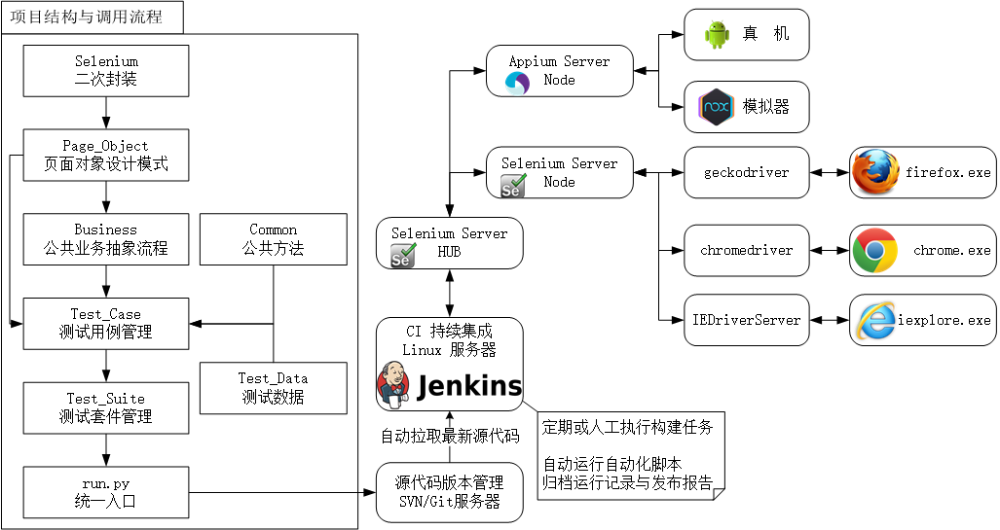
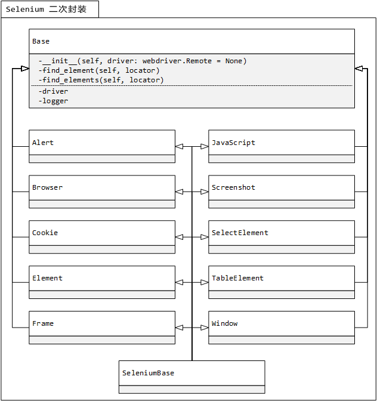

# 欢迎来到我的个人页面

>本页面建议使用 `Chrome` 浏览器浏览

本人先后从事软件开发、测试、需求工程师等岗，涉及到客户需求沟通、技术解决方案撰写、软件编写、协同测试、测试教学等多方面，能及时准确地把握业务需求，具有良好的沟通和协调能力，熟悉测试流程与基本理论，编写有 [`HTMLreport（Python3）`](https://pypi.org/project/HTMLReport/)、[`confucian（Java）`](https://github.com/liushilive/confucian) 等自动化测试框架。

~~本站文档采用 [`Gitbook`](https://www.gitbook.com/) + [`books-cli`](https://www.npmjs.com/package/books-cli) + [`gitbook-plugin-books`](https://www.npmjs.com/package/gitbook-plugin-books) 生成。所用插件均由本人撰写。~~

>由于 `Gitbook` 官方业务转型，暂停维护 `Gitbook-cli`，目前构建一个 `100` 页的页面大约需要四十分钟。`Gitbook` 基于 `Nodejs` 单线程构建太慢了！
>
>本人决定放弃 `Gitbook`，自己开发 [LsBook](https://github.com/liushilive/LsBook/) 作为本站页面生成工具，构建 100 页大约需要 5s。
>
>`LsBook` 基于 `Python` 语言编写，采用多进程机制，速度嘎嘎的，本人前端知识缺乏，目前工具处于开发中，页面生成可能会出现未知情况，如有任何问题，请邮件 <liushilive@outlook.com> 与我沟通。

本人技术关键字：

`Linux` `SQL` `Delphi` `C#` `Java` `Python` `Selenium` `Android` `APPium` `Requests` `Postman` `Jmeter` `Jenkins`

<!-- 我能帮助你完成以下目标：

* 编程语言：`Python`
* `Web UI` 自动化测试
* `API 接口` 自动化测试
* `移动端 UI` 自动化测试 -->

## `自动化测试框架`目标：

* `数据驱动`
* `分布式并发测试`
* `步级报告`
* `步级日志`
* `添加截图至测试报告`
* `封装技巧`
* `失败重试`
* `PageObjects 设计模式`
* `CI 集成`
* `并行 API 接口测试`
* `分布式并行 APP UI 测试`
* 输出 [企业级测试报告](report/report)。

----

>本站资料不确保 100% 准确，如有疑问欢迎来信交流：<liushilive@outlook.com>

<!-- >请勿使用 163 邮箱来信，163 邮箱容易被纳入**垃圾邮件**中！！！ -->

## 知识归档

* [软件测试面试](github_exercise_interview)

* [中级测试人员 **必知必会**](github_exercise_rjpcs_ex)

* [软件测试](github_testing)

* [软件测试词典](github_software_testing_dictionary)

## UI 测试

* [页面元素模拟](html_example)

* [Xpath、CSS 定位器学习盛宴](css_xpath)

* [Selenium 与 浏览器驱动 下载](github_selenium_drivers)

## 接口测试

* [Requests官方文档](http://cn.python-requests.org/zh_CN/latest/)

* [接口测试页面](http://httpbin.org/)

## Android

* [ADB 命令](android/ADB)

* [ADB 命令官方文档](https://developer.android.com/studio/command-line/adb?hl=zh-CN)

* [Monkey 官方文档](https://developer.android.com/studio/test/monkey)

* [logcat 命令行工具 官方文档](https://developer.android.com/studio/command-line/logcat?hl=zh-CN)

* [测试演示用 APP](https://github.com/liushilive/liushilive.github.io/releases/)

<!-- * [官方微信小程序DEMO](https://developers.weixin.qq.com/miniprogram/dev/demo.html) -->

<!-- *  -->

## linux

* [Linux 相关](github_exercise_linux)

## Oracle

* [Oracle 相关](github_exercise_oracle)

## Python

* [Python 相关](github_exercise_python)

## 常用资源

* [常用软件下载](Software-Downloads)

<!-- ## 创作不易，欢迎打赏 -->

<!--   -->

本站总访问量  次 
本站访客数  人次

